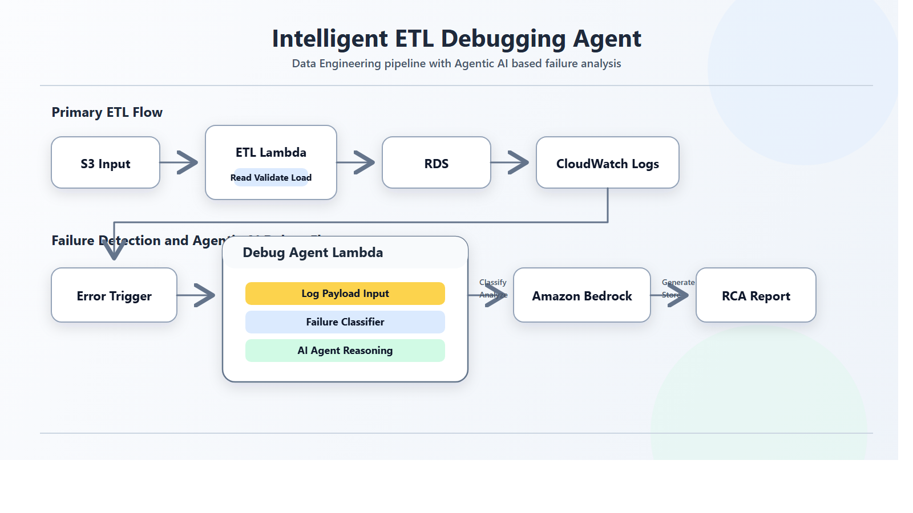

# Agentic AI ETL Debugging Pipeline



## Overview

This project combines serverless data engineering with Agentic AI based debugging to build a production-style ETL pipeline on AWS.

The pipeline ingests structured source data from Amazon S3, processes it through AWS Lambda, and loads it into Amazon RDS for PostgreSQL. On the observability side, ETL failures are captured from Amazon CloudWatch Logs and routed to a dedicated debug agent that uses Amazon Bedrock for failure analysis, root cause detection, and fix generation. For selected known failure categories, deterministic fallback logic is also included to preserve reliability when model access is constrained.

The goal of the project is to show how traditional ETL operations can be combined with AI agents to create a more autonomous, self-debugging data pipeline.

## Features

- Serverless ETL pipeline for loading structured data into PostgreSQL
- Automated failure detection using CloudWatch log-based triggers
- Agentic AI based debugging workflow for ETL error analysis
- Amazon Bedrock powered reasoning for failure classification and fix suggestion
- Rule-based fallback logic for selected known error categories
- Structured RCA report generation for debugging and auditability
- Deduplication-aware loading to support idempotent ETL runs

## Architecture

Primary ETL Flow  
`Amazon S3 -> ETL Lambda -> Amazon RDS PostgreSQL -> CloudWatch Logs`

Debugging Flow  
`CloudWatch Logs -> Error Trigger -> Debug Agent Lambda -> Amazon Bedrock -> RCA Report`

## Technologies Used

- Languages & Libraries: Python, boto3, psycopg2
- Cloud Services: AWS Lambda, Amazon S3, Amazon RDS for PostgreSQL, Amazon CloudWatch Logs, Amazon Bedrock, AWS IAM
- AI Layer: Amazon Bedrock inference profiles with Agentic AI based failure analysis
- Storage & Reporting: PostgreSQL for ETL output, S3 for RCA report persistence

## Project Workflow

### Data Ingestion

Structured source data is stored in Amazon S3 and used as the input layer for the ETL workflow.

### ETL Processing

The ETL Lambda reads the source file, validates and normalizes records, skips invalid rows, and inserts cleaned data into Amazon RDS for PostgreSQL. Duplicate-safe inserts are used to support repeated runs without corrupting the target dataset.

### Logging and Failure Detection

The ETL Lambda emits structured runtime markers such as `ETL_START`, `ETL_ERROR`, and `ETL_SUCCESS`. These logs are captured in CloudWatch, where failure events automatically trigger the debugging pipeline.

### Agentic AI Debugging

The debug agent Lambda receives failure context from CloudWatch Logs and sends the relevant error signal to Amazon Bedrock as the primary reasoning layer. Bedrock is used to classify failures, infer likely root causes, and suggest corrective actions. For a small set of known failure patterns, fallback rule logic is also applied when needed.

### RCA Report Generation

Each debug run produces a structured report that captures the failure category, root cause summary, and suggested fix. This creates an operational record of ETL issues for analysis and demonstration purposes.

## Key Pipeline Capabilities

- Automated ETL execution in a serverless environment
- Bedrock-first debugging flow with AI-assisted failure reasoning
- Event-driven failure handling without manual intervention
- Separation of ETL execution and debugging responsibilities
- High-level agent workflow covering log intake, failure classification, reasoning, fix generation, and report creation

## Project Structure

```text
lambda/
  etl_loader/
    lambda_function.py
    requirements.txt
  debug_agent/
    lambda_function.py
sql/
  create_ev_population.sql
architecture_diagram.png
AWS_conn.ipynb
conn.py
README.md
LICENSE
```

## Key Components

### ETL Loader Lambda

- Reads source data from S3
- Validates and transforms rows
- Loads cleaned records into PostgreSQL
- Emits structured operational logs

### Debug Agent Lambda

- Receives ETL failure events from CloudWatch Logs
- Extracts failure context
- Uses Amazon Bedrock for failure understanding and fix generation
- Applies deterministic fallback logic for selected error categories
- Produces structured debugging output

### SQL Schema

The target relational schema is defined in `sql/create_ev_population.sql`.

## Setup

### Clone the Repository

```bash
git clone https://github.com/saivivek55/Agentic-AI-ETL-Debugging-Pipeline.git
cd Agentic-AI-ETL-Debugging-Pipeline
```

### Configure Environment

Repository code is sanitized for public sharing. Replace placeholder values such as `xxxxx` with your own configuration before deployment.

Typical variables used in the Lambda functions include:

- `S3_BUCKET`
- `S3_KEY`
- `DB_HOST`
- `DB_USER`
- `DB_PASSWORD`
- `RCA_BUCKET`
- `RCA_PREFIX`
- `BEDROCK_MODEL_ID`
- `ENABLE_BEDROCK`

### Deploy the Components

- Deploy the ETL Lambda with required Python dependencies
- Deploy the Debug Agent Lambda
- Create the PostgreSQL schema using the SQL script
- Configure CloudWatch log subscription from the ETL Lambda to the debug Lambda
- Configure Bedrock model access or inference profile access as needed

## Use Cases

- Automated ETL monitoring for serverless data pipelines
- AI-assisted debugging for failed data engineering jobs
- Demonstration of Agentic AI integration in cloud data workflows
- Root cause analysis automation for operational incidents

## Conclusion

This project demonstrates how a traditional ETL workflow can be extended with Agentic AI to create a more intelligent and self-debugging data platform. By combining AWS serverless services, structured logging, automated failure triggers, and Amazon Bedrock based reasoning, the system moves beyond simple data movement and toward autonomous operational support.

## License

This project is licensed under the Apache License.